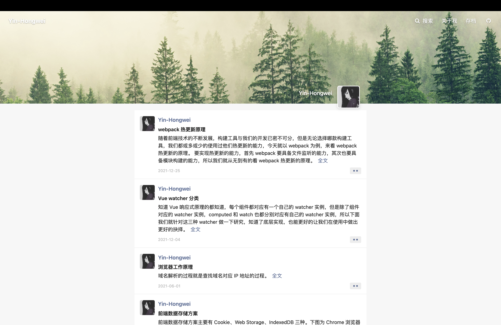

<h1 align="center">hexo-theme-Yin</h1>

<p align="center">
  Clean · Responsive · Social-feed-style Hexo theme
</p>

<p align="center">
  <a href="https://github.com/Yin-Hongwei/hexo-theme-Yin"></a>
  <a href="https://github.com/Yin-Hongwei/hexo-theme-Yin/network/members"></a>
  <a href="https://github.com/Yin-Hongwei/hexo-theme-Yin/blob/master/LICENSE"></a>
  <a href="https://github.com/Yin-Hongwei/hexo-theme-Yin/issues"></a>
</p>

<p align="center">
  <a href="README.md">中文</a> · <b>English</b>
</p>



**Live demo:** [Hongwei Blog](https://yin-hongwei.github.io/)

A clean, responsive Hexo theme with a social-feed-style homepage, local search, Gitalk comments, and optional post rewards.

## Features

| | |
| --- | --- |
| 🏠 **Social-feed homepage** | Card-based layout for personal blogs and content |
| 🔍 **Dual search** | Local search or Algolia full-text search |
| 🌙 **Dark mode** | Light, dark, or system preference with local storage |
| 💬 **Gitalk comments** | Lightweight comments powered by GitHub Issues |
| 📊 **SEO & analytics** | Open Graph, JSON-LD, GA4 / Baidu / Umami, and more |
| ⚡ **Reading experience** | Lazy-loaded images, TOC sidebar, copyright, rewards |

## Table of contents

- [Requirements](#requirements)
- [Installation](#installation)
- [Configuration](#configuration)
  - [Site assets](#site-assets)
  - [Navigation menu](#navigation-menu)
  - [Local search](#local-search)
  - [Gitalk comments](#gitalk-comments)
  - [Post rewards](#post-rewards)
  - [Lazy-loaded images](#lazy-loaded-images)
  - [Dark mode](#dark-mode)
  - [Post copyright](#post-copyright)
  - [Algolia search](#algolia-search)
  - [SEO](#seo)
  - [Analytics](#analytics)
  - [About page](#about-page)
  - [Other options](#other-options)
- [License](#license)

## Requirements

- [Hexo](https://hexo.io/) 7.x+
- Node.js 14+

## Installation

1. Clone the theme into your Hexo `themes` directory:

```bash
cd themes
git clone https://github.com/Yin-Hongwei/hexo-theme-Yin.git
```

2. Enable the theme in your site `_config.yml`:

```yaml
theme: hexo-theme-Yin
```

3. Install required renderers if they are not already present:

```bash
npm install hexo-renderer-ejs hexo-renderer-stylus --save
```

4. Generate and preview:

```bash
hexo clean && hexo generate && hexo server
```

Visit `http://localhost:4000`.

## Configuration

Theme defaults live in `themes/hexo-theme-Yin/_config.yml`. Override them in your site root `_config.yml` under `theme_config` so personal settings (API keys, social links, etc.) stay out of the theme repo:

```yaml
theme_config:
  language: en
  avatar: /img/avatar.jpg
  menu:
    About: /about
    Archives: /archives
    GitHub:
      url: https://github.com/your-name
      icon: github
  social:
    envelope-o: you@example.com
    github: https://github.com/your-name
    weibo: https://weibo.com/your-name
  local_search:
    enable: true
  comments:
    gitalk:
      enable: true
      owner: your-github-username
      admin: your-github-username
      repo: your-repo
      client_id: your_client_id
      client_secret: your_client_secret
  reward:
    enable: true
    alipay: /img/reward.jpg
```

### Site assets

Place images under `source/img/` in your Hexo project:

| File | Purpose |
| --- | --- |
| `avatar.jpg` | Profile avatar |
| `bg.jpg` | Homepage cover |
| `favicon.ico` | Browser icon |
| `reward.jpg` | Reward QR code (optional) |

### Navigation menu

Each menu entry maps a label to a path, or to an object with `url` and optional Font Awesome `icon`:

```yaml
theme_config:
  menu:
    Home: /
    Archives: /archives
    GitHub:
      url: https://github.com/your-name
      icon: github
```

External links open in a new tab automatically.

### Local search

1. Install the search generator:

```bash
npm install hexo-generator-search --save
```

2. Add search config to site `_config.yml`:

```yaml
search:
  path: search.xml
  field: post
  content: true
  format: xml
```

3. Enable search in `theme_config`:

```yaml
theme_config:
  local_search:
    enable: true
```

### Gitalk comments

1. Create an OAuth App at [GitHub Developer Settings](https://github.com/settings/developers).
2. Set **Authorization callback URL** to your site URL (e.g. `https://your-name.github.io`).
3. Fill `client_id`, `client_secret`, `owner`, `admin`, and `repo` in `theme_config.comments.gitalk`.

### Post rewards

1. Put a QR code image in `source/img/`.
2. Enable and set the path:

```yaml
theme_config:
  reward:
    enable: true
    alipay: /img/reward.jpg
```

### Lazy-loaded images

Enabled by default. Adds `loading="lazy"` to content images while keeping the first image eager for LCP:

```yaml
theme_config:
  lazyload:
    enable: true
```

### Dark mode

Toggle in the header; supports `auto` (system), `light`, or `dark`. Preference is stored in the browser:

```yaml
theme_config:
  dark_mode:
    enable: true
    default: auto
```

### Post copyright

Shows author, permalink, license, and last updated time at the end of each post:

```yaml
theme_config:
  copyright:
    enable: true
    license: CC-BY-NC-SA-4.0
```

Licenses: `CC-BY-4.0`, `CC-BY-NC-4.0`, `CC-BY-NC-SA-4.0`, `CC-BY-SA-4.0`, `All-Rights-Reserved`.

### Algolia search

Algolia takes priority over local search when both are enabled.

1. Install the indexer:

```bash
npm install hexo-algoliasearch --save
```

2. Configure indexing in site `_config.yml`, then run `hexo algolia`.
3. Enable in `theme_config` with a **Search-Only API Key**:

```yaml
theme_config:
  algolia_search:
    enable: true
    app_id: YOUR_APP_ID
    api_key: YOUR_SEARCH_ONLY_API_KEY
    index_name: your_index_name
    hits_per_page: 10
```

### SEO

Enabled by default. Outputs canonical URLs, Open Graph, Twitter Cards, and JSON-LD:

```yaml
theme_config:
  seo:
    enable: true
    og_image: /img/bg.jpg
    twitter_site: '@your_handle'
    rss: atom.xml
    google_site_verification: ''
    baidu_site_verification: ''
```

Override per post with front-matter `og_image` or `description`. For RSS, install `hexo-generator-feed` and set `seo.rss` to your feed path.

### Analytics

Supports Google Analytics 4, Baidu Tongji, Umami, and Cloudflare Web Analytics (alongside Busuanzi):

```yaml
theme_config:
  analytics:
    google:
      enable: true
      id: G-XXXXXXXXXX
    baidu:
      enable: false
      id: your_baidu_id
    umami:
      enable: false
      website_id: your-website-id
      script: https://analytics.example.com/script.js
    cloudflare:
      enable: false
      token: your_cf_token
  busuanzi:
    enable: true
```

### About page

Create `source/about/index.md`:

```markdown
---
title: About
type: about
---
Your bio here.
```

### Other options

See `themes/hexo-theme-Yin/_config.yml` for more settings:

- `home.cover_img` — homepage background
- `post.top_img_height` / `post.top_img_position` — post header image
- `post_meta` — date, categories, tags display
- `sidebar.display` — show TOC sidebar on posts (`post`), index, or hide (`hidden`)
- `toc.enable` — table of contents inside posts
- `lazyload.enable` — lazy-loaded images
- `dark_mode.enable` / `dark_mode.default` — dark mode
- `copyright.enable` / `copyright.license` — post copyright block
- `algolia_search.enable` — Algolia full-text search
- `seo.enable` — SEO metadata and structured data
- `analytics.google` / `analytics.baidu` / `analytics.umami` — site analytics
- `footer.startTime` — site start year shown in footer
- `busuanzi.enable` — PV/UV counters ([Busuanzi](https://busuanzi.ibruce.info/))

## License

[MIT](http://opensource.org/licenses/MIT)

Copyright (c) 2019 Yin-Hongwei
