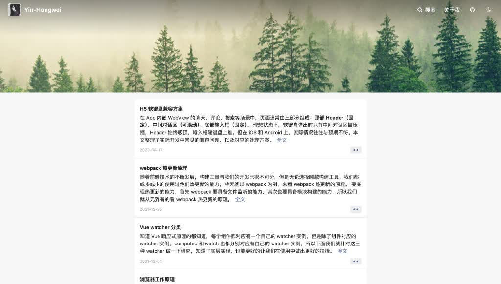

<h1 align="center">hexo-theme-Yin</h1>

<p align="center">
  简洁 · 响应式 · 社交动态风 Hexo 主题
</p>

<p align="center">
  <a href="https://github.com/Yin-Hongwei/hexo-theme-Yin"></a>
  <a href="https://github.com/Yin-Hongwei/hexo-theme-Yin/network/members"></a>
  <a href="https://github.com/Yin-Hongwei/hexo-theme-Yin/blob/master/LICENSE"></a>
  <a href="https://github.com/Yin-Hongwei/hexo-theme-Yin/issues"></a>
</p>

<p align="center">
  <b>中文</b> · <a href="README.en.md">English</a>
</p>



**在线预览：** [Hongwei Blog](https://yin-hongwei.github.io/)

一款简洁、响应式的 Hexo 主题，支持社交动态风格首页、本地搜索、Gitalk 评论与文章赞赏。

## 特性

| | |
| --- | --- |
| 🏠 **社交动态首页** | 卡片式信息流布局，适合个人博客与内容展示 |
| 🔍 **双搜索方案** | 本地搜索 / Algolia 全文搜索，按需启用 |
| 🌙 **暗色模式** | 支持浅色、深色与跟随系统，偏好本地保存 |
| 💬 **Gitalk 评论** | 基于 GitHub Issues 的轻量评论系统 |
| 📊 **SEO & 统计** | Open Graph、JSON-LD、GA4 / 百度 / Umami 等 |
| ⚡ **阅读体验** | 图片懒加载、目录侧边栏、版权声明、文章赞赏 |

## 目录

- [环境要求](#环境要求)
- [安装](#安装)
- [配置说明](#配置说明)
  - [站点资源](#站点资源)
  - [导航菜单](#导航菜单)
  - [本地搜索](#本地搜索)
  - [Gitalk 评论](#gitalk-评论)
  - [文章赞赏](#文章赞赏)
  - [图片懒加载](#图片懒加载)
  - [暗色模式](#暗色模式)
  - [文章版权声明](#文章版权声明)
  - [Algolia 搜索](#algolia-搜索)
  - [SEO 增强](#seo-增强)
  - [站点统计](#站点统计)
  - [关于页](#关于页)
  - [更多选项](#更多选项)
- [许可证](#许可证)

## 环境要求

- [Hexo](https://hexo.io/) 7.x+
- Node.js 14+

## 安装

1. 在 Hexo 项目的 `themes` 目录下克隆主题：

```bash
cd themes
git clone https://github.com/Yin-Hongwei/hexo-theme-Yin.git
```

2. 在站点根目录 `_config.yml` 中启用主题：

```yaml
theme: hexo-theme-Yin
```

3. 安装主题所需的渲染器（若尚未安装）：

```bash
npm install hexo-renderer-ejs hexo-renderer-stylus --save
```

4. 生成并预览站点：

```bash
hexo clean && hexo generate && hexo server
```

浏览器访问 `http://localhost:4000`。

## 配置说明

主题默认配置见 `themes/hexo-theme-Yin/_config.yml`。个人化设置（社交链接、评论密钥、打赏等）建议写在站点根目录 `_config.yml` 的 `theme_config` 中，避免敏感信息进入主题仓库：

```yaml
theme_config:
  language: zh-CN
  avatar: /img/avatar.jpg
  menu:
    关于我: /about
    存档: /archives
    GitHub:
      url: https://github.com/your-name
      icon: github
  social:
    envelope-o: you@example.com
    github: https://github.com/your-name
    weibo: https://weibo.com/your-name
  local_search:
    enable: true
  comments:
    gitalk:
      enable: true
      owner: your-github-username
      admin: your-github-username
      repo: your-repo
      client_id: your_client_id
      client_secret: your_client_secret
  reward:
    enable: true
    alipay: /img/reward.jpg
```

### 站点资源

将图片放在 Hexo 项目 `source/img/` 目录下：

| 文件 | 用途 |
| --- | --- |
| `avatar.jpg` | 头像 |
| `bg.jpg` | 首页封面 |
| `favicon.ico` | 浏览器图标 |
| `reward.jpg` | 赞赏二维码（可选） |

### 导航菜单

菜单项为「标签 → 路径」映射；也支持带图标的对象写法：

```yaml
theme_config:
  menu:
    首页: /
    存档: /archives
    GitHub:
      url: https://github.com/your-name
      icon: github
```

外部链接会自动在新标签页打开。

### 本地搜索

1. 安装搜索生成插件：

```bash
npm install hexo-generator-search --save
```

2. 在站点 `_config.yml` 中添加搜索配置：

```yaml
search:
  path: search.xml
  field: post
  content: true
  format: xml
```

3. 在 `theme_config` 中启用：

```yaml
theme_config:
  local_search:
    enable: true
```

### Gitalk 评论

1. 在 [GitHub Developer Settings](https://github.com/settings/developers) 创建 OAuth App。
2. **Authorization callback URL** 填写站点地址（如 `https://your-name.github.io`）。
3. 将 `client_id`、`client_secret`、`owner`、`admin`、`repo` 填入 `theme_config.comments.gitalk`。

### 文章赞赏

1. 将收款码图片放入 `source/img/`。
2. 启用并配置路径：

```yaml
theme_config:
  reward:
    enable: true
    alipay: /img/reward.jpg
```

### 图片懒加载

默认开启，构建时为文章图片添加 `loading="lazy"`，首屏图片保持即时加载：

```yaml
theme_config:
  lazyload:
    enable: true
```

### 暗色模式

导航栏提供切换按钮，支持跟随系统（`auto`）、固定浅色或深色，偏好保存在浏览器本地：

```yaml
theme_config:
  dark_mode:
    enable: true
    default: auto  # light | dark | auto
```

### 文章版权声明

在文章末尾展示作者、链接、协议等信息：

```yaml
theme_config:
  copyright:
    enable: true
    license: CC-BY-NC-SA-4.0
    # author: 自定义作者名，默认使用 config.author
    # link: 自定义链接，默认使用当前文章 URL
    # content: 附加说明文字
```

可选协议：`CC-BY-4.0`、`CC-BY-NC-4.0`、`CC-BY-NC-SA-4.0`、`CC-BY-SA-4.0`、`All-Rights-Reserved`。

### Algolia 搜索

Algolia 与本地搜索二选一；同时启用时优先使用 Algolia。

1. 安装索引插件：

```bash
npm install hexo-algoliasearch --save
```

2. 在站点 `_config.yml` 中配置索引（示例）：

```yaml
algolia:
  appId: YOUR_APP_ID
  apiKey: YOUR_ADMIN_API_KEY
  adminApiKey: YOUR_ADMIN_API_KEY
  indexName: your_index_name
  chunkSize: 5000
```

3. 推送索引：

```bash
hexo algolia
```

4. 在 `theme_config` 中启用（使用 **Search-Only API Key**）：

```yaml
theme_config:
  algolia_search:
    enable: true
    app_id: YOUR_APP_ID
    api_key: YOUR_SEARCH_ONLY_API_KEY
    index_name: your_index_name
    hits_per_page: 10
```

### SEO 增强

默认开启，自动输出 canonical、Open Graph、Twitter Card 与 JSON-LD 结构化数据：

```yaml
theme_config:
  seo:
    enable: true
    canonical: true
    open_graph: true
    twitter_card: true
    json_ld: true
    robots: index,follow
    og_image: /img/bg.jpg          # 默认分享图
    twitter_site: '@your_handle'     # 可选
    rss: atom.xml                    # RSS 路径，不需要可设为 false
    google_site_verification: ''     # Google Search Console
    baidu_site_verification: ''      # 百度站长验证
```

文章可在 front matter 中单独指定 `og_image` 或 `description` 覆盖默认值。

RSS 需安装 feed 插件：

```bash
npm install hexo-generator-feed --save
```

并在站点 `_config.yml` 中配置 `feed` 后，`seo.rss` 填写对应路径（如 `atom.xml`）。

### 站点统计

支持 Google Analytics 4、百度统计、Umami、Cloudflare Web Analytics，与不蒜子可并存：

```yaml
theme_config:
  analytics:
    google:
      enable: true
      id: G-XXXXXXXXXX
    baidu:
      enable: false
      id: your_baidu_id
    umami:
      enable: false
      website_id: your-website-id
      script: https://analytics.example.com/script.js
    cloudflare:
      enable: false
      token: your_cf_token
```

### 关于页

在 `source/about/` 下创建 `index.md`：

```markdown
---
title: 关于我
type: about
---
在这里写个人介绍。
```

### 更多选项

更多配置项见 `themes/hexo-theme-Yin/_config.yml`：

- `home.cover_img` — 首页背景图
- `post.top_img_height` / `post.top_img_position` — 文章头图样式
- `post_meta` — 日期、分类、标签显示
- `sidebar.display` — 侧边栏显示范围（`post` / `index` / `hidden` 等）
- `toc.enable` — 文章内目录
- `lazyload.enable` — 图片懒加载
- `dark_mode.enable` / `dark_mode.default` — 暗色模式
- `copyright.enable` / `copyright.license` — 文章版权声明
- `algolia_search.enable` — Algolia 全文搜索
- `seo.enable` — SEO 元数据与结构化数据
- `analytics.google` / `analytics.baidu` / `analytics.umami` — 站点统计
- `footer.startTime` — 页脚显示的建站年份

## 许可证

[MIT](http://opensource.org/licenses/MIT)

Copyright (c) 2019 Yin-Hongwei
